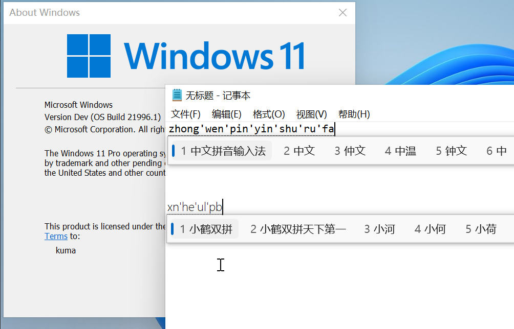
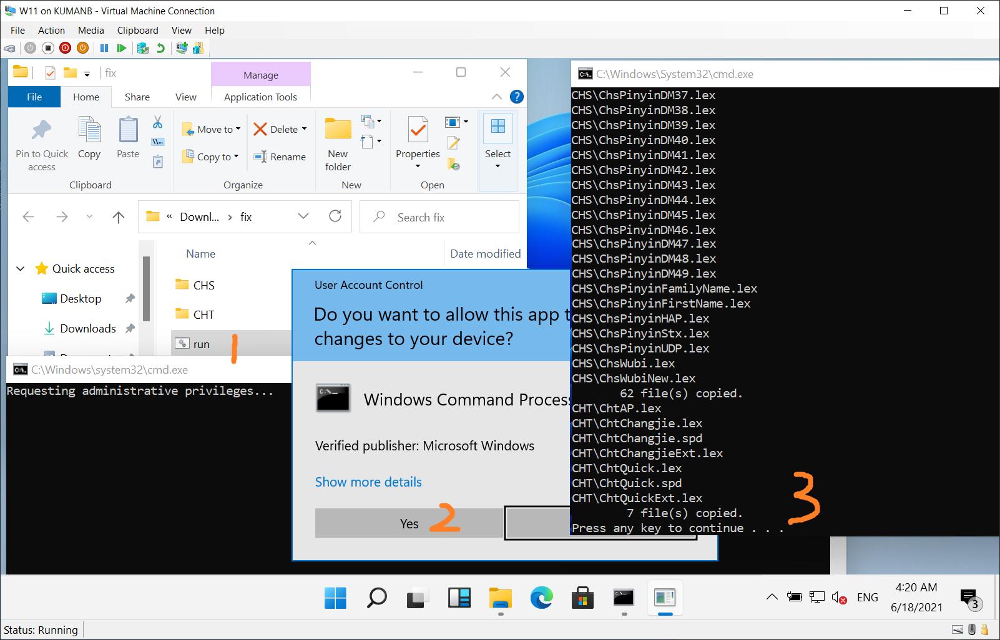

# win11-chn-fix

Windows 11 Chinese Input Method Fix

Win 11 中文 微软拼音输入法修复

## Acknowledgment 致谢

This fix is an implement of
[**Shelling's**](https://twitter.com/cjybyjk)
[**fix**](https://twitter.com/cjybyjk/status/1405424576134225922).

这个项目的修复方式来自
[**Shelling**](https://twitter.com/cjybyjk) 的
[**方法**](https://twitter.com/cjybyjk/status/1405424576134225922) 。

## Instructions 操作方式

1. **Add Chinese**   From the **Settings** App, in `Time & Language` - `Language` - `Preferred languages`, click `Add a language`, select `中文（中华人民共和国） / Chinese (Simplified, China)` (zh-CN in this case, or other variations if you need), and click `Next`.

2. **Install the language**   Check only `Install language pack`, and click `Install`, then wait for complete.

3. **Download the fix**   Download the [**fix.zip**](https://github.com/KumaTea/win11-chn-fix/releases/download/v1.0/fix.zip) archive from the [release](https://github.com/KumaTea/win11-chn-fix/releases) page, extract it to wherever.

4. **Apply the fix**   Either:   * copy both `CHS` and `CHT` to `C:\Windows\InputMethod\`   * run the `run.bat` script.

---

1. **添加中文**   打开 **Settings** App, 进入 `Time & Language` - `Language` - `Preferred languages`, 点击 `Add a language`, 选择 `中文（中华人民共和国） / Chinese (Simplified, China)` (或其他变种), 再点击 `Next` 。

2. **安装语言**   选中 `Install language pack`, 再点击 `Install`, 等待安装完成。

3. **下载文件**   从 [release](https://github.com/KumaTea/win11-chn-fix/releases) 页面下载 [**fix.zip**](https://github.com/KumaTea/win11-chn-fix/releases/download/v1.0/fix.zip), 解压到任意位置。

4. **修复系统**   任选其一:   * 复制 `CHS` 和 `CHT` 到 `C:\Windows\InputMethod\`   * 运行脚本 `run.bat` 。

